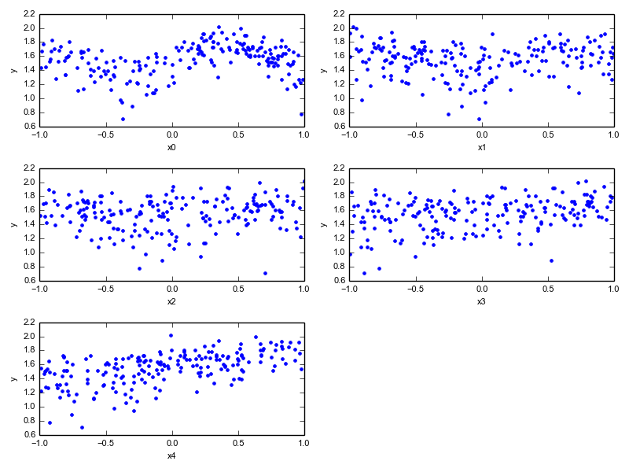
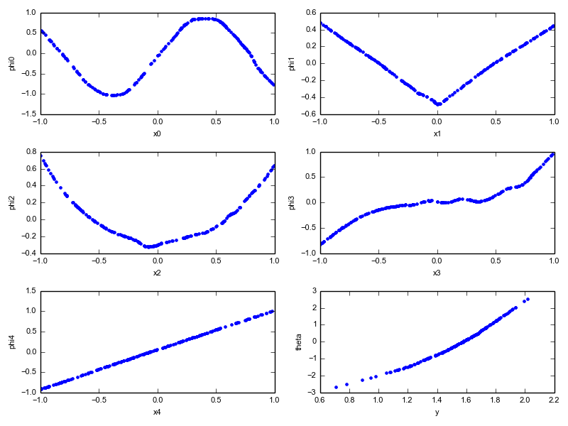

Sample ACE Problems
===================
Several sample problems from public literature are provided in the :py:mod:`ace.samples`
subpackage. The one from [Wang04]_ is particularly good at demonstrating the power
of the ACE algorithm. It starts by building test data using the following formula:

.. math::

	y(X) = \text{log}\left(4 + \text{sin}(4 X_0) + |X_1| + X_2^2 + X_3^3 + X_4 + 0.1\epsilon\right)

where :math:`\epsilon` is sampled from standard normal distribution. The input data (N=200) is
shown below. As you can see, it's pretty ugly, and it'd be difficult to understand the
underlying structure by doing normal regressions.

But go ahead and try running ACE on it, like this::

	from ace.samples import wang04
	wang04.run_wang04()

This will produce resulting transforms that look like the ones in the figure below. As you can
see, ACE performed surprisingly well at extracting the underlying structure. You can clearly
see the sine wave, the absolute value, the cubic, etc. It's fabulous!

